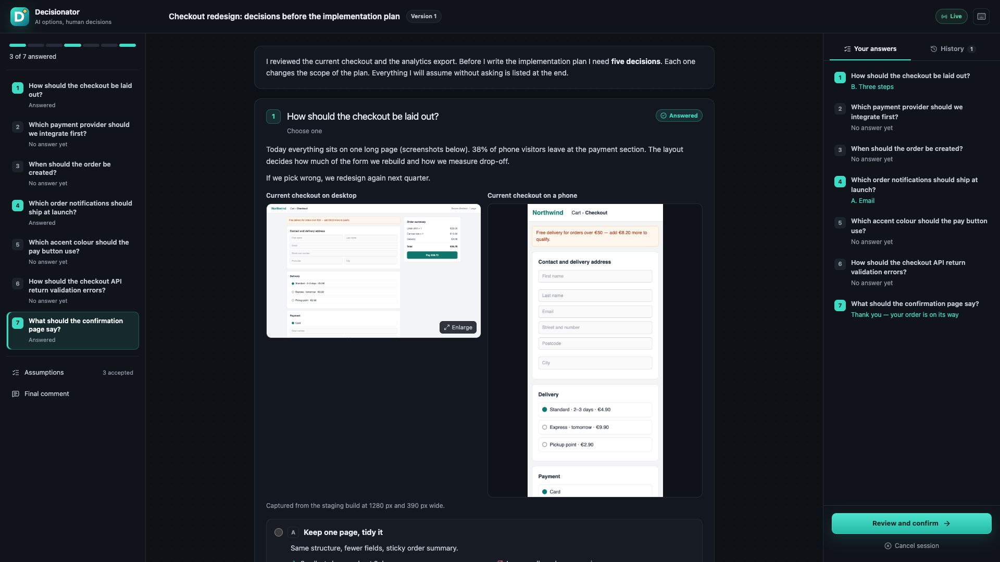

<div align="center">
  
  <h1>Decisionator</h1>
  <p><strong>AI options, human decisions.</strong></p>

  [](https://github.com/johniak/decisionator/actions/workflows/ci.yml)
  [](https://github.com/johniak/decisionator/releases)
  [](LICENSE)
</div>

Decisionator turns "the agent needs a few decisions before it can continue" into one focused, local decision screen. The agent writes every open question as a group of real options with trade-offs, mockups, diagrams, or charts. You answer, discuss any question with the agent in place, and confirm the whole batch at once. The agent waits until you confirm and then continues with structured answers.

Decisionator supports Claude Code and Codex through one shared skill and data contract. It is the sibling of [Reviewonator](https://github.com/johniak/reviewonator) and uses the same local, human-in-the-loop workflow.

<p align="center">
  
</p>

See the [feature guide](docs/features.md) for a visual walkthrough of options and mockups, live discussions, version history, and the confirmation preview.

## Why Decisionator?

- Every decision gets 2–4 real options with pros, cons, and an honest one-sentence recommendation that is shown as a label, never pre-selected.
- Hard-to-describe choices are shown: screenshots, side-by-side comparisons, HTML wireframes in light and dark, Mermaid flows and sequences, charts, comparison tables, key figures, colour palettes, code, and diffs.
- Discuss one question with the agent without leaving the page. Its reply and any revision of that question appear in the same browser session, with the revised group highlighted.
- Nothing reaches the agent until you press **Send to AI** on a discussion or **Confirm** the batch. Your choices and comments stay in the browser until then.
- Skipping a question is an explicit choice, recorded as "adopted the recommendation by skipping".
- Attach screenshots to an answer, a comment, a discussion message, or the final comment: paste them, drop them on the field, or choose files. The agent receives them as image files.
- Object to any assumption the agent plans to adopt.
- The confirmation dialog shows exactly what the agent will receive, including the raw JSON.
- Reload the page or restart the session and your draft is still there.

## How it works

1. The installed Claude Code or Codex skill writes a validated JSON decision document.
2. The skill starts `decisionator <SESSION_ID> --file <JSON_PATH> --live` in the background. A loopback-only web application opens in your browser.
3. The agent runs `decisionator wait <SESSION_ID>`, which blocks until you act.
4. **Send to AI** returns that question's discussion. The agent answers it, may revise the question, runs `decisionator respond`, and waits again in the same session.
5. **Confirm** returns every answer, comment, skipped question, assumption decision, and your final comment. **Cancel** returns "no decisions were made".

## Requirements

- macOS or Linux on x64 or ARM64
- [Claude Code](https://docs.anthropic.com/en/docs/claude-code/overview), Codex, or both
- [GitHub CLI](https://cli.github.com/) to download a release with the installer

[Bun](https://bun.sh/) is required only when building from source.

## Install

Clone the repository and run the installer:

```sh
gh repo clone johniak/decisionator
cd decisionator
./scripts/install.sh
```

The installer first asks you to choose Claude Code, Codex, or both; it never chooses an agent integration silently. It then asks which language the agent should use for decision screens and replies. The language defaults to English, while the application interface always stays in English.

When a local build is not present, the installer downloads the latest binary for your platform from GitHub Releases and verifies its SHA-256 checksum. It installs:

- the executable in `~/.local/bin/decisionator`;
- the Claude Code skill in `~/.claude/skills/decisionator`, when selected;
- the Codex skill in `~/.agents/skills/decisionator`, when selected.

Make sure `~/.local/bin` is on your `PATH`. Custom locations are supported:

```sh
./scripts/install.sh \
  --targets claude,codex \
  --bin-dir "$HOME/bin" \
  --claude-skill-dir "$HOME/.claude/skills" \
  --codex-skill-dir "$HOME/.agents/skills" \
  --language Polish
```

`--targets` accepts `claude`, `codex`, or a comma-separated selection. Non-interactive installation must provide `--targets` or `DECISIONATOR_TARGETS`; the installer never guesses. `DECISIONATOR_LANGUAGE` sets the language non-interactively.

To install from a source checkout instead:

```sh
bun install --frozen-lockfile
bun run build
./scripts/install.sh --local
```

The installer and uninstaller use ownership markers and refuse to overwrite or remove files they do not manage.

## Use

Ask the agent for decisions, or invoke the skill directly.

In Claude Code:

```text
/decisionator Before you plan the checkout redesign, ask me everything you need to decide.
```

In Codex:

```text
$decisionator Before you plan the checkout redesign, ask me everything you need to decide.
```

The skill also opens a decision screen on its own when a task needs several related decisions, a design round, or a screenshot review. In the browser:

1. Read each question's context, options, and visuals.
2. Choose an option, write an **Other** answer, or skip the question.
3. Add a private comment to any question. Paste, drop, or add screenshots to any answer, comment, or message.
4. Use **Discuss with AI** and **Send to AI** when you need a better option, a clearer trade-off, or a different mockup. Keep answering while the agent replies.
5. Accept or object to the agent's assumptions.
6. Open **Review and confirm**, check the preview, and send the decisions.

You can also answer in the terminal, for example `1B 2A`. The agent records those answers the same way.

## Update and uninstall

Run the installer again to check GitHub Releases and update an older managed installation:

```sh
./scripts/install.sh
```

The installer skips the download when the installed version is current, preserves the configured language, and refuses to downgrade a newer build. Use `--force` to reinstall or downgrade to the latest release.

Check the installed version with:

```sh
decisionator --version
```

Run the uninstaller and select one or both agent integrations to remove:

```sh
./scripts/uninstall.sh
```

The same `--targets`, `--bin-dir`, `--claude-skill-dir`, and `--codex-skill-dir` options are available when uninstalling. The executable remains installed while another managed integration still uses it.

## Development

```sh
bun install --frozen-lockfile
bun run demo
```

`bun run demo` opens the example in [`examples/checkout-redesign.json`](examples/checkout-redesign.json), which uses every kind of visual. To drive a live session by hand, run the agent side in a second terminal:

```sh
bun run dev -- my-session --file path/to/decisions.json --live
decisionator wait my-session
decisionator respond my-session --file path/to/updated-decisions.json
```

Useful commands:

```sh
bun run typecheck   # TypeScript validation
bun run test        # Production web build and full test suite
bun run build       # Single-file web app and native executable, signed ad hoc on macOS
bun run check       # Typecheck, tests, and production build
```

Tests exercise the decision contract, the confirmation result, the live session protocol over a real local server, the browser workspace against that server, mockup sanitizing, the file-serving allowlist, the CLI, installation, and release packaging. Please do not replace real behavior with mocks unless an integration cannot be exercised practically.

The decision contract is documented for agents in [`skills/decisionator/references/decision-schema.md`](skills/decisionator/references/decision-schema.md) and [`skills/decisionator/references/mockups.md`](skills/decisionator/references/mockups.md).

## Release process

1. Update the version in `package.json`.
2. Ensure `bun run check` passes.
3. Create and push a tag such as `v0.1.0`.

The release workflow builds binaries for macOS and Linux on x64 and ARM64, packages the skill and license notices, creates SHA-256 checksums, and publishes a GitHub Release. macOS binaries are built on macOS runners and signed ad hoc by `scripts/build-cli.sh`, because `bun build --compile` leaves them with an invalid signature that macOS refuses to run; the release fails if a packaged macOS binary does not pass `codesign --verify --strict`.

## Project status

Decisionator is an early-stage project. Its workflow and JSON contract may evolve before version 1.0. Claude Code and Codex are supported today.

## Contributing and security

Contributions are welcome. Read [CONTRIBUTING.md](CONTRIBUTING.md) and the [Code of Conduct](CODE_OF_CONDUCT.md) before opening a pull request.

Please report vulnerabilities privately according to [SECURITY.md](SECURITY.md), not through a public issue.

## License

Decisionator is available under the [MIT License](LICENSE). Third-party attribution is documented in [THIRD_PARTY_NOTICES.md](THIRD_PARTY_NOTICES.md).
