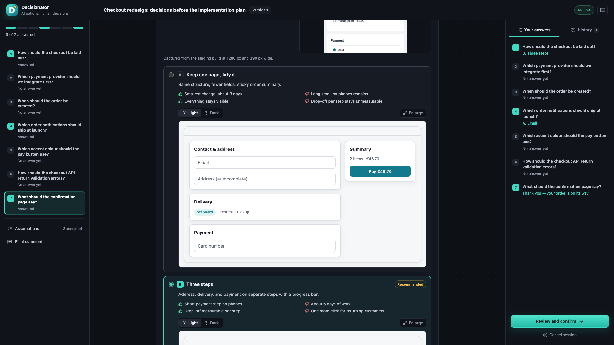
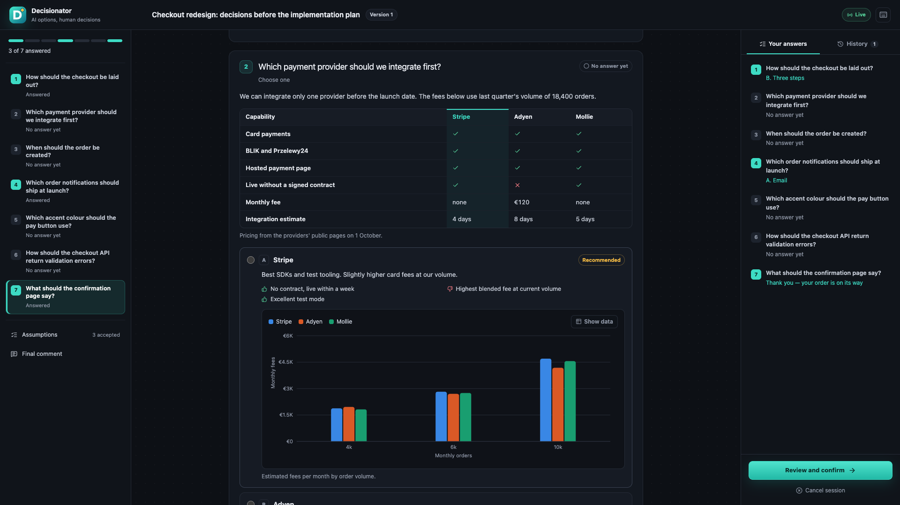
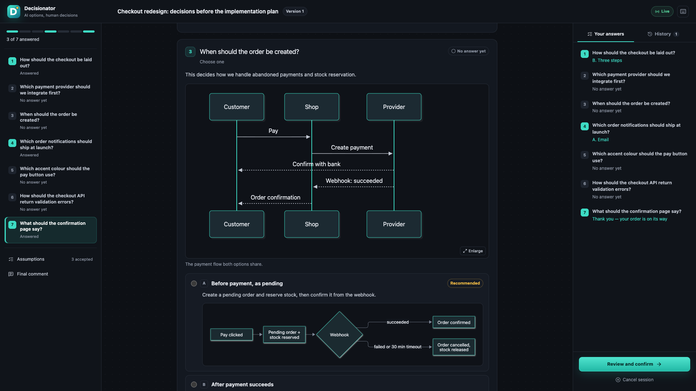
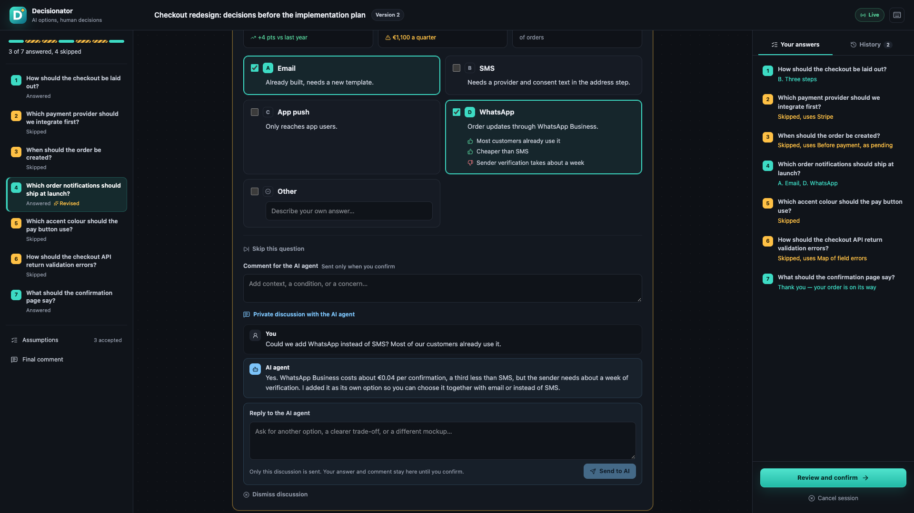
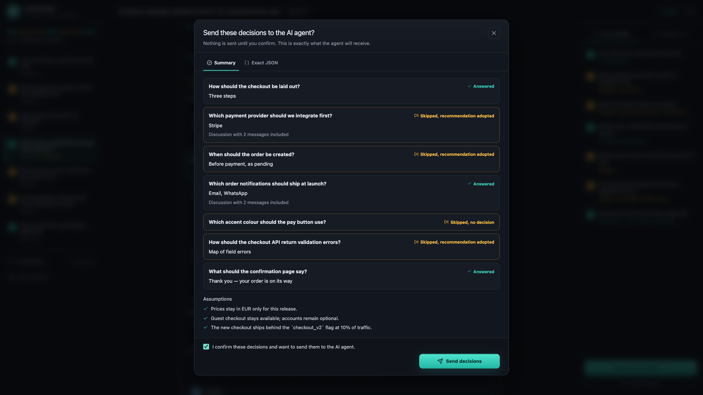

# Feature guide

Decisionator is a local, human-in-the-loop decision screen for AI coding agents. The agent prepares the questions; you decide, and nothing reaches the agent until you say so.

## See every open decision at once

The workspace lists every question of the batch in the left sidebar. The progress rail above it has one segment per question, so answered, skipped, and waiting questions are visible at a glance, and the line below it says how many are answered and how many are waiting for the agent. The right panel keeps a running summary of your answers.

Each question explains why the decision matters and what it costs if it is wrong. Options are lettered so you can also answer in the terminal, and the agent's recommendation is shown as a label with one sentence of reasoning. Nothing is pre-selected.

## Look at real options

Options come with their own trade-offs, listed as pros and cons. Layout questions carry HTML mockups that you can switch between light and dark and enlarge. The agent builds them from neutral wireframe parts, and they render in a sandboxed frame without scripts or network access.

## Compare with tables, charts, and figures

Most visuals need no HTML at all. The agent describes them in JSON and Decisionator draws them consistently:

- comparison tables with ✓ and ✗ cells and a highlighted recommendation;
- bar, line, area, pie, scatter, and radar charts with a legend, tooltips, and a data table;
- key figures, colour palettes, highlighted code, and unified or side-by-side diffs;
- screenshots, alone or side by side, which you can click to enlarge.

Flows, sequences, state machines, data models, and timelines are written as Mermaid diagrams.

## Show what you mean with a screenshot

Every answer field, comment, discussion message, and the final comment takes images. Paste a screenshot with ⌘V or Ctrl+V, drop image files on the field, or use **Add image**. Attached images appear as thumbnails that you can enlarge or remove, and an image alone counts as the answer to an open question or an **Other** answer.

Images stay in this browser, and survive a reload, until you press **Send to AI** or **Confirm**. The agent then receives them as PNG, JPEG, GIF, or WebP files of up to 15 MB each, ten per field at most, and the confirmation preview lists the exact file paths.

## Discuss a question without leaving the page

Use **Discuss with AI** on any question and press **Send to AI**. Only that question's discussion is sent, with the images attached to your message; your choices and comments stay in the browser. While the header shows **AI working**, you can keep answering the other questions, or prepare several discussions and send them together.

The agent answers in the same thread. When the discussion changes the decision, it revises the question, and Decisionator marks it **Revised in version 2** and says what changed. Choices that still exist are kept; if an option you picked was removed, the question tells you to choose again. Only you can dismiss a discussion, and your reason is sent with your decisions.

The **History** tab lists every version of the screen. Open an earlier version to read it, its mockups, and its discussions as they were, then return to the current one.

## Confirm deliberately

**Review and confirm** opens the final dialog. If questions are still unanswered, it lists them with the recommendation that will apply, and you choose between going back and skipping them explicitly. The preview then shows every answer, comment, skipped question, discussion, assumption decision, and your final comment. The **Exact JSON** tab shows the payload exactly as the agent will receive it.

Sending requires a separate confirmation checkbox. The **Decisions sent** screen stays readable afterwards. **Cancel session** tells the agent that no decisions were made.

## Work the way you prefer

- Use the keyboard: J and K move between questions, 1–4 choose options, O writes an Other answer, C comments, D starts a discussion, and ? lists the shortcuts.
- Reload the page at any time; your draft is kept in this browser.
- If the session restarts with the same ID, the open tab reconnects on its own.
- Answer in the terminal instead; the agent records those answers too.

## Use the same workflow with Claude Code or Codex

The installer can target Claude Code, Codex, or both. It also configures the language the agent uses for decision screens and replies; the interface itself stays in English. The decision contract and the confirmation flow are the same for both agents.
